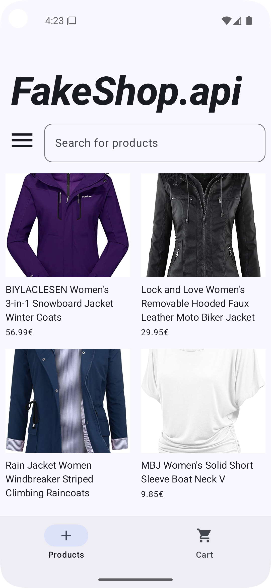
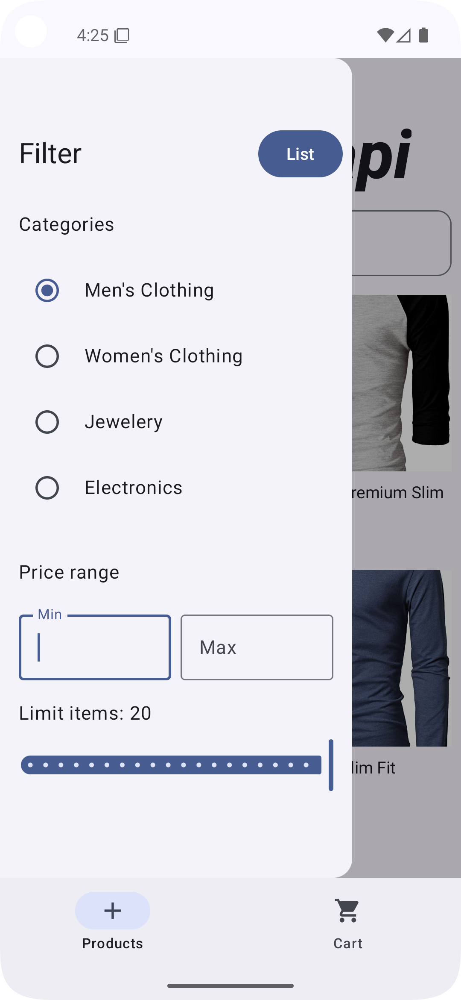
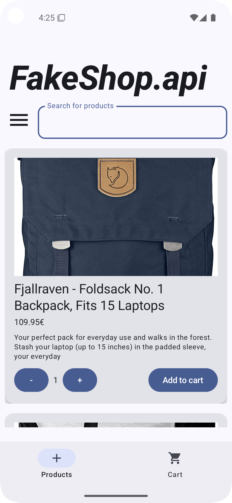
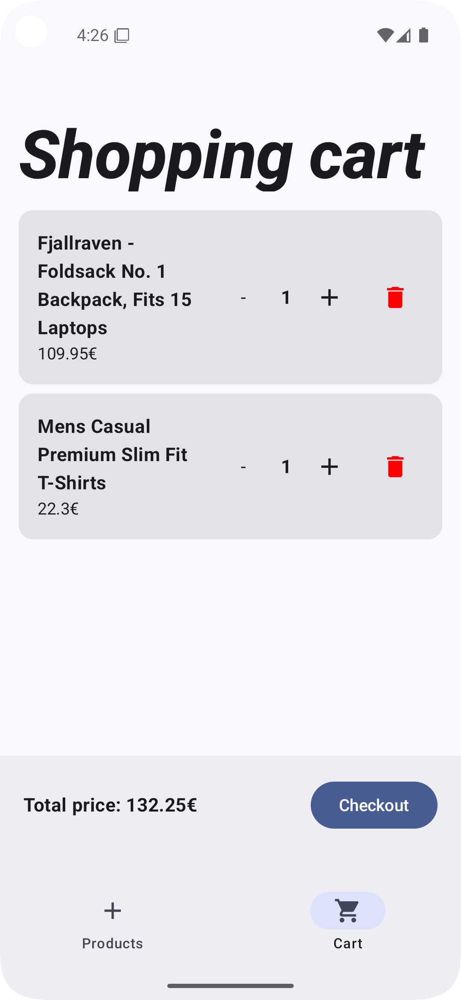
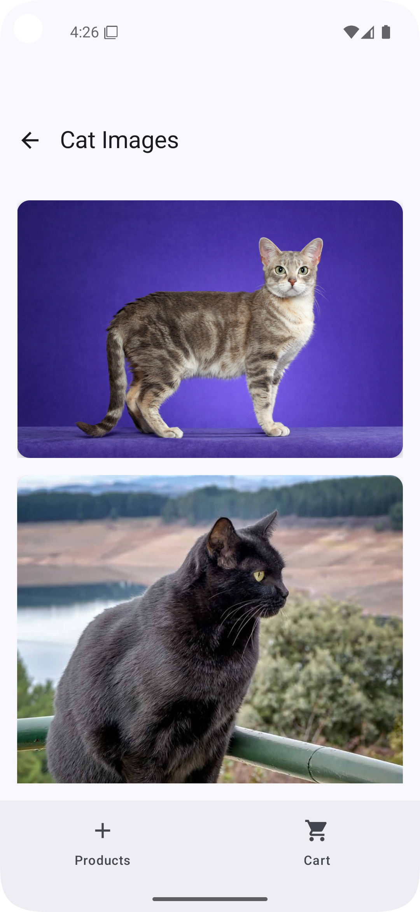

# 🛒 FakeShop API App

A responsive Android shopping app built with **Jetpack Compose**.  
This demo integrates a public REST API and features filtering, cart management, and a clean MVVM architecture.

---

## ✨ Features

- 🛍 Load products via [FakeStoreAPI](https://fakestoreapi.com)
- 🔍 Filter by category and price range
- 🧱 Switch between `LazyColumn` (list) and `LazyVerticalGrid` (grid)
- 🛒 Cart system with quantity adjustment and total calculation
- 💡 State-driven UI with `StateFlow` and `ViewModel`
- 📷 Image loading with Coil

---

## 🧰 Tech Stack

- **Kotlin** + Jetpack **Compose**
- **MVVM** architecture
- **Retrofit** for API calls
- **Coil** for images
- **Material 3** for UI components

---

## 📸 UI Preview

<p align="center">
  
  
  
  
  
</p>

---

## 🚀 Getting Started

```bash
git clone https://github.com/Zeeehner/fake-shop-api-app.git


🐾 Fun Detail

Try searching for cat in the search bar – you'll unlock a hidden LazyColumn easter egg. 😺
